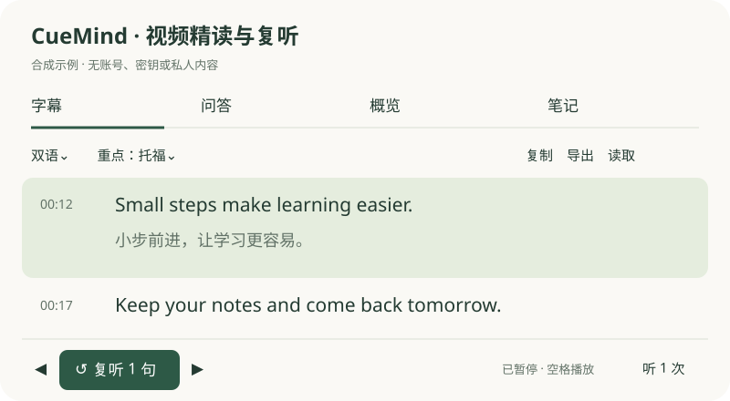

# CueMind

Read, replay and study YouTube and Bilibili videos in a Chrome side panel. CueMind uses your own model accounts and keys, stores learning data locally, and has no developer backend or telemetry.

[简体中文](README.md) · [Privacy](PRIVACY.md) · [Security](SECURITY.md) · [Changelog](CHANGELOG.md) · [Troubleshooting](docs/TROUBLESHOOTING.md)



## Install and update

Desktop Chrome 116+ is the primary supported environment. No build tools are needed for installation.

- Source download: keep the project in a permanent directory. Open `chrome://extensions`, enable Developer mode, choose Load unpacked and select `extension/`.
- Release `CueMind-v1.0.29.zip`: unzip to a permanent directory and select the enclosed `CueMind/` directory containing `manifest.json`.
- Developer source archive `CueMind-source-v1.0.29.zip`: select `CueMind-source/extension/`.

Open a standard YouTube watch or Bilibili video page and click CueMind. Native captions, search, replay, original notes and export need no API key. Configure your text model for translation, explanations and AI features. Supadata is optional for existing YouTube captions. Audio transcription needs a separate Whisper-compatible ASR service.

To update, replace files in the original loaded directory, reload the existing extension card and refresh open video tabs if needed. Do not uninstall first or load a different directory each time. Unpacked extensions do not update automatically. Back up learning data before updating; backups exclude settings keys and must not be made public.

## Features and requests

CueMind preserves original captions, sentence IDs and timing evidence. It supports searchable original/translated/bilingual subtitles, continuous sentence selection, 1/3/infinite replay, per-goal vocabulary emphasis, separate original/translation overlay font sizes, contextual explanations, cited questions, chapters, quotes, learning maps and timestamped notes. Export TXT, SRT, Markdown, JSON, outlines and Mermaid mindmaps.

Use the arrow buttons or double-press arrow keys to expand a selection. Space replays the selected range; another Space exits replay and continues normal playback. Escape stops replay. Text inputs keep normal typing behavior.

Bilingual or translated mode can automatically translate missing captions across the whole video when a configured model is available. Playback-near batches are prioritised, results are saved progressively, and cancellation keeps completed work. Configured models may also polish quick notes in the background. These features can incur provider charges. Native captions are read directly; translation is generated by your configured model.

Unchanged complete results are reused locally based on content, context, provider, model and prompt. Failed batches retry missing work. Changed inputs/settings, explicit regeneration, cleared caches or missing intermediate caches after restoring on another machine can require new requests. Provider billing may still occur after a timeout or failure.

Saved learning data does not silently expire. Settings show approximate content sizes and browser storage estimates. Delete all notes removes only notes, preserving learning and response caches. Clear learning cache removes AI-derived data, chats and response caches, retaining original captions, notes, settings and keys. Reset clears all extension data and settings. Back up before destructive operations.

## Keys and privacy

Enter real keys yourself in the local Settings page only. Never put them in source files, environment files, AI chats, screenshots, public issues or Git commits. Keys remain in `chrome.storage.local`; IndexedDB stores learning records. When calling a cloud service, the extension sends the corresponding key for authentication and the required subtitles, questions, notes or audio directly to that service. Local storage is not an encrypted password vault. Provider retention is independent of local deletion. See [Privacy](PRIVACY.md).

Text providers include OpenAI, Gemini, DeepSeek and OpenAI-compatible/local Ollama services. ASR supports timestamped Whisper-compatible responses, including configured Groq/OpenAI services. API credits are not included. Check provider pricing and set spending limits.

## Compatibility and limitations

Chrome desktop standard watch/video pages are the supported and tested environment. Edge shares Chromium APIs but has not completed independent compatibility acceptance. Firefox, Safari and mobile browsers are not supported. Shorts, live streams, embeds, restricted videos and unavailable native captions may not work; import or explicit audio transcription is available on supported video pages.

Platform-burned subtitles cannot be removed. Sentence timing is based on available captions, not guaranteed word-level audio alignment. Model judgments and vocabulary priorities may be inaccurate. Quotes matching the source do not guarantee correct reasoning.

## Development

Use Node.js 22+. There are no third-party runtime JavaScript dependencies. Python 3.12 and pinned Playwright are used for isolated browser tests.

```bash
npm ci
npm test
npm run check
npm run format:check
npm run build
```

Builds produce allowlisted extension and public source ZIPs, SHA-256 files and file lists, without a system zip dependency. Checks reject common credential patterns, learning backups, symlinks and Git files outside the public list. CI runs release checks and browser fixtures, without real API keys or your daily browser. Live-provider verification remains a separate release step. See [Development](docs/DEVELOPMENT.md).

We welcome redacted functional issues and PRs. See [Contributing](CONTRIBUTING.md). Report security issues privately following [Security](SECURITY.md).

CueMind code is [MIT](LICENSE). Upstream notices are preserved in [Third-party notices](THIRD-PARTY-NOTICES.md). Demo content is synthetic; see [Assets](docs/ASSETS.md).
