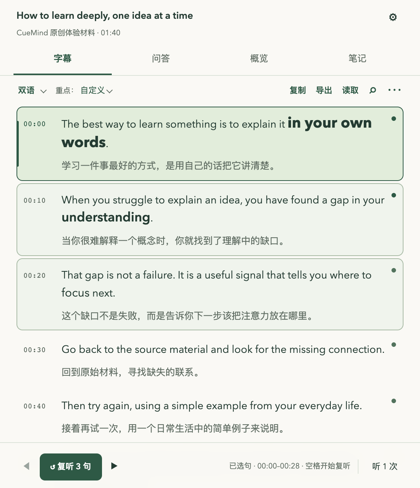
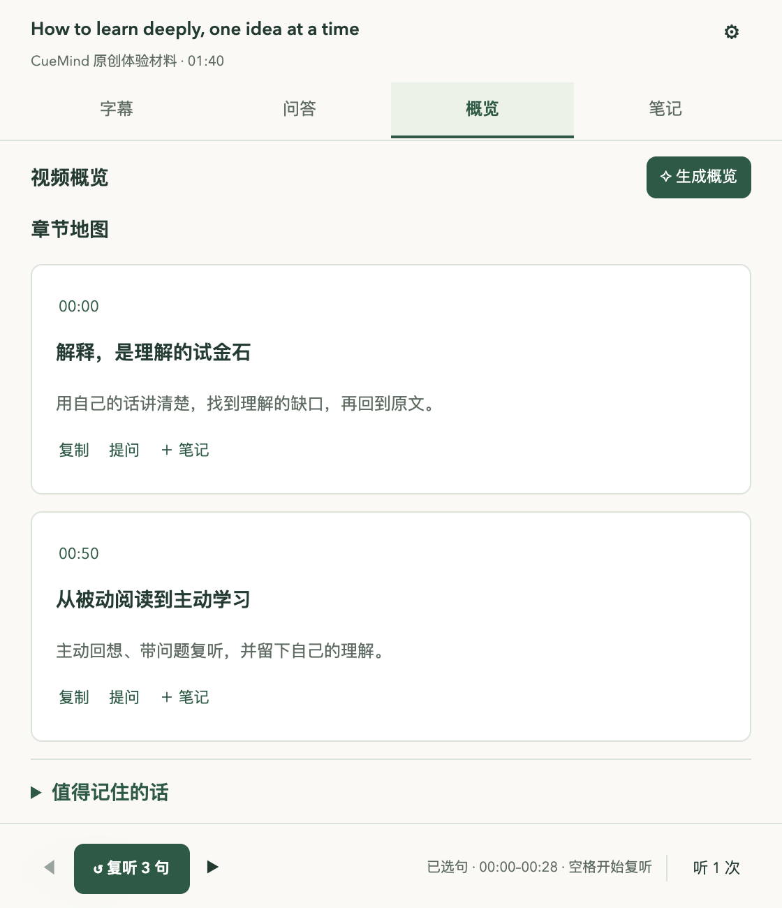
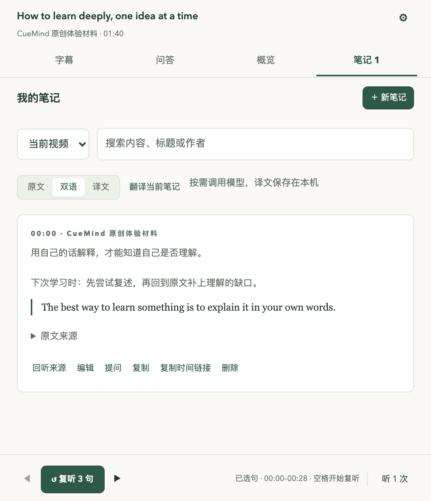

# CueMind · 视频精读与复听

**从一句话，听懂一整个视频。**

CueMind 是一款开源的桌面 Chrome 扩展，把 YouTube 和 Bilibili 视频变成可以逐句阅读、双语学习、反复听懂和随手记下的学习资料。咪咕赛事播放页也支持从当前播放音频识别字幕。适合练习英语听力、精读课程，以及整理访谈和演讲中的观点。

用自己的模型账号和 API Key，学习记录保存在本机。无需注册 CueMind 账号，也没有开发者服务器、积分系统或遥测。

[快速安装](#快速安装) · [配置 API](#配置-api) · [功能与用法](#功能与用法) · [常见问题](#常见问题) · [English](README.en.md)

## 可以用它做什么？

- **一句没听懂，就听这一句。** 选一句或连续几句，听 1 次、3 次或循环，无需来回拖动视频进度条。
- **看原文，也看懂意思。** 原文、双语、译文随时切换；配置模型后，双语模式会自动分批翻译全片。
- **把注意力放在值得学的词上。** 按考试或行业目标显示三级重点词，也可以维护自己的术语和已掌握词。
- **遇到疑问，带着原文问。** 选词看语境解释，按当前句、片段或全片提问，再从引用回到视频核对。
- **留下理解，而不只是收藏链接。** 视频播放时按 `N` 记笔记，保留原文、时间和来源；之后可以回听、搜索和导出。
- **先用已有结果。** 已完成的字幕、译文和匹配的 AI 结果优先从本机恢复，失败任务保留进度，只补缺失部分。



*上图为插件实际界面，使用内置原创示例；重点词来自手动术语表，未调用模型。示例可以体验阅读、笔记和导出，不连接真实播放器。*

## 快速安装

需要 **桌面 Chrome 116 或更新版本**。普通使用无需安装 Node.js、Python，也不用执行构建命令。当前通过“加载已解压的扩展程序”安装。

### 手动安装

1. 在[本仓库首页](https://github.com/harveyzhang604/cuemind)点击绿色 **Code → Download ZIP**。也可以[直接下载主分支源码](https://github.com/harveyzhang604/cuemind/archive/refs/heads/main.zip)。
2. 解压，并把项目放到一个固定位置，例如文档目录下的 `CueMind`。安装后仍需保留这个文件夹。
3. 在 Chrome 地址栏输入 `chrome://extensions`，打开扩展程序管理页。
4. 打开页面右上角的 **开发者模式**。
5. 点击 **加载已解压的扩展程序**。
6. 选择项目里的 **`extension` 文件夹**。直接下载 ZIP 时通常是 `cuemind-main/extension/`；这个文件夹内应有 `manifest.json`。
7. 点击 Chrome 工具栏的拼图图标，把 **CueMind · 视频精读与复听**固定到工具栏。
8. 打开一个 YouTube 或 Bilibili 视频，点击扩展图标或视频里的 **CueMind** 按钮，再点击 **读取当前视频**。咪咕赛事页请先选好节目，再点击 Chrome 工具栏的 CueMind 图标。

**加载的是 `extension/`，不是整个项目文件夹，也不是 ZIP 文件。** 如果暂时没有视频，可以在面板点击 **先体验示例**，不用填 Key。

<details>
<summary>让编码助手帮你安装</summary>

把下面这段话交给你使用的编码助手即可。它负责下载和定位文件，你在 Chrome 设置页填写自己的 Key。

```text
请帮我安装 CueMind Chrome 扩展：
https://github.com/harveyzhang604/cuemind

下载或克隆到一个固定的本地目录，保留项目文件。
检查 extension/manifest.json，并告诉我 extension 文件夹的完整路径。
指导我在 chrome://extensions 开启开发者模式，加载这个 extension 文件夹，
然后打开视频验证 CueMind 面板能显示。
普通安装不需要构建。不要读取我的浏览器配置、API Key 或学习备份；
需要的 Key 由我自己在插件设置页填写，不写入代码或 Git。
```

</details>

## 配置 API

**原文字幕、搜索、复听、手动笔记和导出，不需要 API Key。** 想要翻译、解释、问答或分析时，再配置文本模型即可。

| 你想做什么 | 需要配置什么 |
| --- | --- |
| 读取平台已有字幕、逐句复听、手动保存笔记 | 无需额外服务 |
| 双语翻译、选词解释、视频问答、概览、重点词分析、AI 整理笔记 | 文本模型 |
| 使用备用服务读取 YouTube 已有字幕 | Supadata，可选 |
| 视频没有字幕，用音频生成字幕；咪咕赛事页识别原文 | 语音转写服务 |
| 为识别出的原文生成中文译文 | 文本模型 |

### 文本模型：以 DeepSeek 为例

1. 打开 [DeepSeek API 平台](https://platform.deepseek.com/api_keys)，在自己的账号中创建 API Key；确认账号有可用额度。
2. 点击 CueMind 面板右上角的 **⚙ 设置**，找到 **文本模型**。
3. 在服务商中选择 **DeepSeek**。插件会填入默认地址与模型：

   | 设置项 | 内容 |
   | --- | --- |
   | 服务商 | DeepSeek |
   | API 基础地址 | `https://api.deepseek.com` |
   | 模型名称 | `deepseek-flash` |
   | API Key | 在本机填写自己创建的 Key |
   | 目标语言 | 按需选择，例如简体中文 |

4. 点击 **保存设置**。如果 Chrome 请求访问该服务地址的权限，允许后完成保存。
5. 回到视频面板，选择 **双语**。译文会随着翻译进度逐步出现。

以上地址与模型对应插件当前预设；服务商可能调整模型，使用时以 [DeepSeek 官方文档](https://api-docs.deepseek.com/)为准。CueMind 不赠送 API 额度，也不代收模型费用。

**也可以使用其他模型。** 设置中支持 OpenAI、Google Gemini、DeepSeek 和 OpenAI-compatible 服务，包括本地 Ollama。选择预设服务商，或填写兼容接口的地址、模型和鉴权信息，再保存。云服务 Key 可在 [OpenAI](https://platform.openai.com/api-keys)、[Google AI Studio](https://aistudio.google.com/apikey) 或对应服务商的官方控制台创建。

<details>
<summary>可选：Supadata 字幕服务</summary>

默认直接读取 YouTube / Bilibili 字幕，无需 Supadata。

若需要 YouTube 的备用字幕获取方式，在 [Supadata 控制台](https://dash.supadata.ai/)创建账号和 Key，然后到 **设置 → 字幕服务**填写 **Supadata API Key**。获取方式可以选择 **平台读取失败时使用 Supadata**，保存设置即可。

Supadata Key 与文本模型 Key 独立。CueMind 只向它请求视频已有字幕，不自动生成 AI 字幕；Bilibili 仍由平台直接读取。使用时会发送视频链接和原文语言，服务可能收费。

</details>

<details>
<summary>可选：无字幕视频的音频转写</summary>

到设置中的语音服务部分选择供应商并填写独立 ASR Key，支持 Groq、OpenAI、豆包语音与带时间戳的 Whisper-compatible 接口。选择“按平台选择”后，YouTube 使用海外配置，咪咕/B站使用国内配置。两套地址、模型及 Key 分别保存在本机，运行时自动选择；翻译仍使用文本模型（如 DeepSeek）。旧配置默认保持共用，需主动启用按平台选择。

国内可选[豆包语音](https://console.volcengine.com/speech/app)，开通录音文件识别极速版并填写新版控制台 API Key。扩展会在本机把浏览器音频转为 WAV，并使用服务返回的分句时间戳；也可使用自己的国内 Whisper 兼容服务。海外 Groq Key 可在 [Groq 控制台](https://console.groq.com/keys)创建。设置页的连接检查不发送 Key 或音频，只验证服务能否连通；实际识别还需要有效 Key、权限和额度。扩展不修改系统代理，所选视频与 ASR 服务需在当前网络下同时可访问。

随后在字幕工具栏点击 **⋯ → 导入字幕与音频**，选择导入 SRT/VTT、上传音频，或点击 **识别当前视频音频**。扩展只提取正在播放的音频并发送到配置的转写服务，不保存视频画面；需要按 1× 实时播放来对齐时间戳。识别由你主动开始，服务可能收费。侧栏会按首段约 10 秒、后续每段约 1 分钟显示视频剩余部分的计划、排队与等待时间和每段结果，并显示音频大小及电平，方便区分采集问题与语音服务问题。语音服务超时后会停止继续采集；已完成的字幕仍保存在本机，可以从失败区间重试。

文本模型、Supadata 和语音转写分别配置，各自的 Key 不通用。已有平台字幕的视频通常不需要语音服务。

</details>

### 咪咕赛事视频

打开咪咕赛事播放页并选择可播放的英文原声节目，点击 Chrome 工具栏的 CueMind 图标，再点击 **读取当前视频 → 从当前位置连续识别**。没有可读取字幕轨时，CueMind 从实际播放的音频逐段生成带时间戳的原文字幕：首段约 10 秒，随后每段约 1 分钟。侧栏会列出从当前位置到视频末尾的分段计划、当前处理区间，以及各段原文、译文的完成或失败状态。配置文本模型后，原文成功的段落会继续自动补译，双语字幕逐步显示在侧栏和视频上。播放到哪里就处理到哪里；停止后已完成的原文和译文保存在本机。再次识别时会跳过连续完成的音频，不会越过失败区间。不同节目分别保存。

音频识别需要播放器按 1× 正常播放；尚未播放的区间不会提前识别。暂停、跳转、变速或切换视频会结束当前采集，已完成片段保留。失败片段会显示时间和原因，可把播放位置移回该片段后重试。若页面提示版权或地区限制、没有视频音频，扩展无法取得该段声音；可以导入自己已有的音频或字幕文件。

## 功能与用法

### 1. 读字幕，听懂所选的几句

读取视频后，侧栏按时间显示字幕，播放时跟随当前句。工具栏可以切换 **原文 / 双语 / 译文**，也可以直接 **复制、导出、读取**，或用搜索定位某个表达。

点击一句字幕，把它作为复听起点；用底栏左右按钮扩展连续选句范围，再点击 **复听几句**或按空格。右侧的 **听 1 次**可以切换为 **听 3 次**或 **循环**。

| 操作 | 快捷方式 |
| --- | --- |
| 开始复听已选范围 | `空格` |
| 退出复听，继续正常播放 | 复听时再按 `空格` |
| 正常播放 / 暂停 | 未选复听范围时按 `空格` |
| 向前 / 向后扩大选句范围 | 底栏左右按钮，或连续按两次 `←` / `→` |
| 停止复听 | `Esc` |
| 搜索字幕 | `/` |
| 随手记下当前内容 | `N` |

快捷键在文字输入框中不会抢占输入。手动滚动查看其他字幕后，点击 **当前句**恢复跟随；点击 **字幕开头**只调整阅读位置，不拖动视频。

### 2. 自动补齐双语，调整重点和字号

配置文本模型后，选择侧栏的 **双语 / 译文**，或把视频字幕设为双语，就会自动分批补齐全片译文。翻译优先处理播放附近，完成一批就显示并保存一批，可以边看边等。

工具栏的 **重点**入口可以选择四级、六级、雅思、托福、医学、金融、计算机或自定义目标。点击 **分析重点词**后，相关表达以三级字号显示；不同目标的分析分别保存，切回时恢复已有结果。

这里也可以独立调整 **侧栏字号、视频原文字号、视频译文字号**。自定义术语和已掌握词立即生效，不需要调用模型。AI 判断的是学习目标与语境的相关性，并非官方考试词表。

### 3. 解释选词，带着上下文提问

用鼠标选中字幕中的词或短语，点击 **解释选中内容**，查看语境中的词义、发音以及中英文解释。解释弹窗打开时，背景字幕暂停滚动；关闭后继续阅读。

切换到 **问答**，选择当前句、所选片段或全片范围，再提出问题。回答带原文引用，可以回到对应内容核对，也可以保存为笔记。相同有效输入的解释和问答会优先复用本地结果。

### 4. 看概览，把观点变成自己的笔记

在 **概览**点击 **生成概览**，得到章节地图、值得记住的话和分段精讲。字幕菜单里的 **复听地图**可以帮助选择值得精听的片段。

视频播放时，点击视频上的 **Note · N** 或按 `N`，可以记录当前内容。原文先保存，配置模型后再做整理；笔记保留时间和来源，后续可以编辑、搜索、回听来源或复制时间链接。

| 章节地图 | 带来源的本地笔记 |
| --- | --- |
|  |  |

*两张截图均来自内置原创示例：章节内容随示例提供，笔记通过实际界面手动保存；不代表真实视频的模型生成结果。*

### 5. 导出、备份，再回来继续学

点击工具栏的 **导出**，按用途选择：

| 格式 | 适合什么用途 |
| --- | --- |
| TXT / SRT | 保存字幕文本，或在其他播放器中使用时间轴字幕 |
| Markdown | 带走学习内容与笔记，继续在笔记软件中整理 |
| 大纲 / Mermaid 思维导图 | 根据已有概览梳理结构 |
| 完整 JSON 备份 | 备份学习数据，之后从导入入口恢复 |

JSON 备份会移除设置里的三项 Key，恢复到另一台机器后需自行重新填写。备份仍含学习内容，应作为私人文件保存。模型响应缓存和转写中间缓存不进入备份，恢复后缺失的结果可能需要首次请求服务。

## 本地保存与 API 费用

读取到的原始字幕、完成的译文、分析、问答和笔记保存在本机。普通刷新或重开同一个视频，会优先恢复已有资料；任务中断后保留已完成批次，重试时补齐未完成内容。

缓存按内容、上下文、服务地址、模型及提示词等条件匹配。换模型、换学习目标、改输入或提示词偏好时，可能需要新的结果；主动重新生成或清除缓存也可能再次调用服务。**有匹配结果就复用，不等于任何设置变化都沿用旧答案。**

云模型翻译、分析、笔记整理，以及 Supadata 和音频转写，都可能由对应服务商收费。自动全片翻译也属于模型调用；超时或失败不保证服务商未计费。建议在服务商控制台设置额度上限，价格以其官方页面为准。

**API Key 只在本机设置页填写，保存在 `chrome.storage.local`，不上传到本项目仓库。** 请求服务时，Key 作为鉴权凭据发送给对应服务商，相关字幕、问题或音频也会发送。CueMind 没有用于接收这些数据的开发者服务器；完整数据流见 [隐私说明](PRIVACY.md)。本地存储不是加密密码保险箱。

## 更新插件

1. 需要保留学习资料时，先导出完整 JSON 备份。
2. 下载新版，覆盖 Chrome **原先加载的同一个目录**中的项目文件。
3. 打开 `chrome://extensions`，点击 CueMind 卡片上的 **重新加载**。
4. 刷新仍在播放的视频页面，让面板与新版重新连接。

解压加载的扩展不会自动更新。**请保留原目录，不要用“卸载后重装”更新。** 卸载会删除本机扩展数据，换目录也可能产生不同的扩展身份。

## 常见问题

### 没有 Key 能不能先用？

可以。平台已有字幕、搜索、复听、手动笔记和导出都不需要 Key。安装后也可以点击 **先体验示例**熟悉界面；真实视频的 AI 功能需要配置模型。

### 为什么选择双语后，暂时只有原文？

先检查文本模型和目标语言是否已保存。翻译是分批完成的，尚未完成的句子先显示原文；进度提示会更新。失败时可以重试未完成批次，取消后也会保留已完成译文。仅有 Supadata Key 不能翻译字幕。

### 没有字幕，或者读取失败怎么办？

先确认打开的是标准 YouTube `/watch` 或 Bilibili `/video` 播放页，刷新后点击 **读取**。部分视频没有可用字幕，或平台限制访问；可以使用备用字幕服务、导入 SRT/VTT，或主动进行音频转写。烧录在画面里的字幕无法由插件移除。

### 选了托福，为什么重点词还没有变大？

选择目标与分析是两个步骤。打开 **重点**设置，点击 **分析重点词**；已有结果按目标保存，未分析的目标显示普通字号。字号和手动术语不需要 AI。

### 修改提示词，需要会写 JSON 或变量吗？

不需要。在 **设置 → 提示词偏好**里用自然语言写要求即可，例如“请用适合初学者的中文解释，先给结论，再举一个例子”。插件保留原文证据、句子 ID 和输出格式约束，你只需要补充学习偏好；留空使用内置默认。

### API 报错，应该检查什么？

确认选对服务商、地址和模型，Key 有效且账号额度足够。自定义服务还需允许 Chrome 访问其域名。不同服务的 Key 不能混用；限流时稍后重试。更多情况见 [故障排查](docs/TROUBLESHOOTING.md)，反馈时不要附真实 Key。

### 数据越来越多，怎么清理？

设置页可以查看本机数据占用，并分别清除分析缓存、删除笔记或重置全部扩展数据。先备份再操作；**重置全部数据会连同设置和 Key 一起清除**。数据不会自动过期删除。

## 支持范围

| 环境 | 当前状态 |
| --- | --- |
| 桌面 Chrome 116+；标准 YouTube / Bilibili 视频页 | 主要支持与实测环境，Bilibili 支持分 P |
| 桌面 Edge | 使用相同 Chromium API，尚未完成独立兼容验收 |
| Firefox、Safari、移动浏览器 | 当前不支持 |
| Shorts、直播、嵌入页、受限视频 | 不保证平台字幕读取 |

AI 的断句、翻译和解释可能有误，字幕时间也不等于逐词音频对齐。涉及具体事实时请结合原文核对。

## 开发与贡献

欢迎反馈使用问题、改进体验或提交 PR。请在 [Issues](https://github.com/harveyzhang604/cuemind/issues)中描述复现步骤和插件版本，截图先去掉 Key、账号和私人内容。安全问题按 [安全说明](SECURITY.md)私密报告。

开发需要 Node.js 22+；浏览器测试另需 Python 3.12 和锁定版本的 Playwright。扩展没有运行时第三方 JavaScript 依赖。

```bash
git clone https://github.com/harveyzhang604/cuemind.git
cd cuemind
npm ci
npm test
npm run check
npm run format:check
npm run build
```

构建生成扩展安装包、公开源码包、SHA-256 和文件清单。公开文件采用白名单，检查会拒绝白名单外的 Git 文件、常见密钥和学习备份。GitHub Actions 配置了文件与密钥检查、单元测试、格式检查、打包和关键浏览器回归；真实视频与付费服务仍需单独验收。

[开发说明](docs/DEVELOPMENT.md) · [贡献指南](CONTRIBUTING.md) · [更新记录](CHANGELOG.md) · [隐私说明](PRIVACY.md) · [安全说明](SECURITY.md)

## 许可证与致谢

CueMind 自有代码采用 [MIT 许可证](LICENSE)。感谢 [YouTube Digest](https://github.com/zarazhangrui/youtube-digest) 提供的开源参考；本 README 参考了其面向新用户的说明顺序，安装和功能内容按 CueMind 实际实现编写。

项目使用或参考的第三方代码及许可见 [第三方说明](THIRD-PARTY-NOTICES.md)。公开界面图使用 CueMind 原创示例，来源与许可见 [素材说明](docs/ASSETS.md)。
